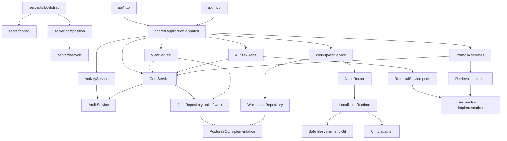

# Atlas Server architecture

Architecture refactor, 2026-10-07. This describes implemented boundaries and explicitly distinguishes future work. This is a code refactor, not a data-model or product-contract migration.

## Terminology and engineering principles

- **Atlas** is the platform/ecosystem.
- **Atlas Server** is the persistent backend/control plane and authoritative data owner.
- **Atlas Web** is the browser client, formerly Observatory. No Web redesign accompanies this refactor.
- **Atlas Node** is a trusted execution device/runtime hosting Workspaces. Node V1 runs locally; see [Atlas Nodes](ATLAS_NODES.md). **Agent** is reserved for AI/software actors.

Projects are the ownership boundary. Today they own Stores, Records, Views and Workspaces, with immutable audit history. Applications and Automations are future Project primitives; do not expose placeholders as implemented capabilities.

> Server capability → stable application/service contract → transport/API → Atlas Web surface.

> AI-creatable, human-inspectable, auditable.

## What changed

Previously `server.ts` combined dependency construction, background startup, MCP schemas/handlers and HTTP routes. MCP registered its own operation callbacks while HTTP maintained a separate Portfolio dispatch table. `AtlasCatalog` combined Core validation/mutations with View definitions, rendering, and actions. `WorkspaceService` coupled persistence/audit with filesystem calls, Git and Unity construction. Ask Atlas referenced concrete Fabric service types. Environment defaults were read across feature modules.

The refactor extracts existing behavior rather than replacing algorithms. Production composition constructs Core, Views, Workspaces, Retrieval, AI and Portfolio once and injects them into transports. Legacy import paths delegate to the extracted implementations. There is no second implementation of Core or Views.

## Current dependency graph



The repository-to-implementation arrows show runtime binding: Core and Workspaces import repository **interfaces**, not PostgreSQL implementations. Service modules never import transport handlers. `server/config.ts` is a leaf configuration loader shared with compatibility constructors; it imports no services. Production configuration is captured at composition, not reread per request.

## Module ownership

| Boundary | Implementation | Responsibilities |
| --- | --- | --- |
| Startup/composition | `src/server.ts`, `src/server/composition.ts`, `src/server/ai.ts` | Configuration, PostgreSQL probe, repository/service construction, local host injection, transport startup |
| Lifecycle | `src/server/lifecycle.ts` | Track existing startup/webhook background work; drain it before closing resources; idempotent close |
| Configuration | `src/server/config.ts` | Server/database, local Workspace, Unity, AI provider, retrieval, Portfolio settings; validate database presence and listen port |
| Core | `src/core/service.ts` | Project/Store/Record operations, schemas, ownership, querying, archival, transaction-scoped record operations |
| Core persistence port | `src/core/repository.ts` | Existing snapshot/query/unit-of-work contract; keep cross-concept transactions atomic |
| Audit | `src/core/audit.ts` | Immutable snapshots appended in the mutation transaction; existing history filters and ordering |
| Activity | `src/activity/service.ts` | Query projection over Audit; no separate event source or mutable activity store |
| Views | `src/views/service.ts` | Definitions, slugs, history, preview/render, declared record actions; existing View Kit/runtime/presentation helpers remain shared |
| Workspaces | `src/workspaces/application.ts`, `model.ts`, `runtime.ts`, `repository.ts` | Ownership, validation, execution policy, mutation intents/outcomes; injected persistence and host contracts |
| PostgreSQL | `src/infrastructure/database/postgres.ts`, `workspaces.ts` | SQL, row mapping, locks, connection leasing and durable commit |
| Nodes | `src/nodes/`, `src/infrastructure/database/nodes.ts` | Persisted registry, runtime contract, status/capability checks and routing |
| Local execution | `src/infrastructure/nodes/local-runtime.ts`, `src/infrastructure/workspaces/files.ts`, `unity.ts` | Local binding validation, safe files, hash conflicts, fixed Git operations, Unity CLI/MCP bridge and approved command policy |
| Retrieval | `src/retrieval/service.ts`, `types.ts`, `indexing.ts` | Search/context/authority ports and published-corpus indexing contract |
| Ask Atlas | `src/ai/ask-atlas/` | Existing interpretation, retrieval planning/execution, grounding, answering and citations |
| Portfolio | `src/portfolio/`, `src/portfolio/ask/` | Specialized Project content, publication revisions, media and fixed-scope Ask Portfolio |
| Transports | `src/api/http/`, `src/api/mcp/` | Existing routes, MCP schemas, origin checks, input handling and response/error mapping |
| Dispatch | `src/server/dispatch.ts`, `core-dispatch.ts` | Shared mapping from existing operation names to services; internal jobs can call services directly |
| Errors | `src/shared/errors.ts` | Transport-independent `AtlasError` with existing stable codes |

Core remains cohesive rather than introducing separate wrappers for every CRUD method. The existing unit-of-work repository is intentional: a View action, record validation and its audit append must share a transaction. SQL and PostgreSQL imports are absent from Core and the Workspace application service.

## Views and transaction safety

`ViewService` owns the extracted View behavior. It receives Core and its unit of work. A saved declared action validates the definition, ownership, allowed fields and fixed values inside the same transaction that calls Core's `createRecordInState` or `updateRecordInState`. Those operations perform existing schema validation and append the original audit operation/snapshots. Success still follows PostgreSQL commit. Do not replace these with separately committed record calls.

View format, templates/html alias, manifest, HTML/CSS/script, sandbox/CSP, URL parameters, preview, View Kit, standalone URLs, history, action names and concurrency behavior are unchanged. View URLs belong to the View capability and transport; Core does not generate Web routes.

## Workspace execution boundary

```text
WorkspaceService
  ├─ WorkspaceRepository → PostgreSQL metadata / locks / audit
  └─ NodeRouter (workspace.nodeId → status/capability validation)
       ├─ bind(rootPath)
       └─ execute(workspace, operation, validatedInput)
            ↓
       LocalNodeRuntime today
            ├─ WorkspaceFiles / fixed Git inspection
            └─ UnityAdapter / locally approved structured commands
```

The Server service never resolves a path, accesses the filesystem, launches Git or constructs Unity. The host interprets bindings and executes capabilities. The persisted/wire `rootPath` stays intact for compatibility; its value is passed to the host, not assumed to be server-accessible. A regression test uses a host-owned binding unavailable to the Server filesystem.

Workspace ownership and schema validation occur before host dispatch. LocalNodeRuntime retains allow-listed canonical roots, traversal/symlink/hardlink and protected-file defenses, byte/UTF-8 limits, SHA-256 conflicts, fixed Git commands, Unity discovery and local approvals. No shell/eval escape or remote networking was added.

Mutations preserve the original protocol:

1. Commit `workspace.mutation_requested` before execution.
2. Lease one persistence connection; acquire execution and Workspace locks and recheck active ownership.
3. Execute through the host; append the outcome and commit before returning success.
4. On failure, roll back and append the bounded failure diagnostic using the leased connection. If execution succeeded but audit finalization failed, return `OUTCOME_UNCERTAIN` instead of inviting an unsafe blind retry.

Inspections retain their original completed/failed audit events without storing file contents, search text, diffs, or command parameters. Workspace persistence owns the SQL representation of these events in the same `audit_events` table queried by Audit/Activity.

### Node V1

Workspace ownership now includes a persisted Node UUID. NodeService registers a stable local identity, advertises capabilities and exposes read-only list/get APIs; NodeRouter routes each execution to its owning runtime. Local implementations remain behind this boundary. Execution locks include Node identity and binding. See [Atlas Nodes](ATLAS_NODES.md) for migration, lifecycle, safety, Web surfaces and the future remote transport seam. Remote networking and generic shell tasks are not implemented.

## Retrieval and AI

Fabric is **frozen**, is a **retrieval implementation**, is hidden behind Retrieval for Ask Atlas and transport search/context calls, and is **not a product primitive**. The implementation remains in `src/fabric/` for its existing debug/configuration tooling. Ranking, semantic fallback, authority/currentness, context budgeting and diagnostic values are unchanged. Legacy response labels such as `fabric` and the existing subsystem status remain for compatibility; they are not a renewed product direction.

Ask Atlas depends on `ContextProvider`, `AuthorityProvider`, retrieval result contracts and Core reader/query contracts. `RetrievalService` receives the current Fabric search/context/authority implementations at composition. It can accept replacements without changing Ask Atlas. Its `request` alias preserves the existing context-provider shape; `context` is the generic application method. Portfolio publication uses `RetrievalIndex` rather than the concrete Fabric repository type. The legacy Contentful integration remains specialized ingestion code using Fabric persistence; its deeper persistence extraction is deferred.

Prompts, models, citations, grounding, abstentions, conversation and Portfolio scope are unchanged.

## Lifecycle and background work

`composeServer(config, executionHost?)` creates the production dependency graph. `startBackgroundWork` registers local Node presence as well as the existing Portfolio rebuild and Contentful startup sync. Node shutdown precedes its database pool shutdown. HTTP webhook acceptance registers sync with the same lifecycle tracker instead of launching an unowned promise. Resource shutdown waits for tracked work, then closes every pool even if one close fails. SIGINT/SIGTERM stop HTTP acceptance and drain the service lifecycle. No Automation scheduler was added.

Existing Portfolio schema initialization and its `ready` promise remain inside PortfolioService for compatibility. This is a known specialized initialization path, not a general model for new services.

## Compatibility and migration ledger

The original Server refactor added no migrations. Node V1 subsequently adds `012_nodes.sql`, backfills Workspace ownership, and adds the Node read APIs; see the Node document for its additive contract changes. No tables, columns, IDs, audit operations or stored values were renamed. Existing migration files and pre-existing checkout changes were retained.

No HTTP route, MCP name or argument schema, response structure, View URL or format was intentionally changed. The shared dispatcher preserves per-transport error envelopes, including legacy 400/404 mapping. `AtlasError` retains its default `INVALID_REQUEST` and existing codes including `NOT_FOUND`, `CONFLICT`, `ADAPTER_UNAVAILABLE`, `WORKSPACE_UNAVAILABLE`, and `OUTCOME_UNCERTAIN`; errors are not renamed just to impose a new taxonomy.

| Previous implementation location | New implementation | Compatibility |
| --- | --- | --- |
| `src/server.ts` transports | `src/api/http/`, `src/api/mcp/` | Original factory exports and entrypoint remain |
| `src/catalog.ts` Core and Views | `src/core/service.ts`, `src/views/service.ts` | `AtlasCatalog` facade forwards View methods; Core methods inherited |
| `src/store.ts` | `src/infrastructure/database/postgres.ts`, `src/core/repository.ts` | Re-exports preserve scripts/tests |
| `src/tools.ts` | `src/server/core-dispatch.ts`, `dispatch.ts` | Legacy function delegates; production uses explicit dependencies |
| `src/workspaces/service.ts` | `src/workspaces/application.ts`, PostgreSQL repository, execution host | Legacy constructor and lazy per-catalog adapter retained only for old callers |
| `src/workspaces/files.ts`, `adapter.ts` | `src/infrastructure/workspaces/` | Re-export modules preserve imports |
| `src/apps/ask-atlas/` | `src/ai/ask-atlas/` | Every old module re-exports its implementation |
| `src/apps/portfolio/`, `apps/ask-portfolio/` | `src/portfolio/`, `portfolio/ask/` | Re-export modules preserve imports |
| `src/fabric/types.ts` | `src/retrieval/types.ts` | Legacy type names/re-exports retained |

Duplicated MCP operation callbacks and the HTTP Portfolio dispatch table were removed. Obsolete unused Core in-memory filter helpers were removed. Compatibility files are intentional, not competing implementations. New production code must not depend on the facades to assemble dependencies.

## Future primitives

- **Applications:** reserve `src/applications/` when there is a real Project-owned service contract. It should own explicit launch/open behavior and consume Core/Views/media services. Portfolio is still specialized Server functionality, not an Application runtime. Do not hard-code Atlas Web routing into Core.
- **Automations:** reserve `src/automations/` for real Project-owned and system jobs. Runners call the same service contracts used by transports, never write around Core/Workspace validation and audit. The existing lifecycle tracker is a home for server-owned work, not a durable scheduler.
- **Nodes:** `src/nodes/` now owns registry, capability contracts and routing. A later remote runtime can implement the same execution boundary. Agents remain AI/software actors.

## Verification and guardrails

Run `npm test` (build plus Node tests). PostgreSQL tests create isolated `atlas_test_*` schemas, apply existing migrations, then clean them up. They require local database access; sandbox-denied network access is not a product failure.

Before refactoring: **91 tests passed** with database access. After refactoring: **98 tests passed**, no skips. Existing coverage includes Core CRUD/schema/query/atomicity, audit, Views/actions/standalone routes, Workspace filesystem/Git/Unity, Portfolio, Ask Atlas, Fabric and HTTP/MCP.

New tests cover:

- Transitive import boundaries, including re-exports, plus transport SQL/environment/construction exclusions.
- The complete MCP tool-name and argument-schema snapshot, captured from the pre-refactor server (`test/mcp-contract.json`).
- A nonlocal host binding, ownership isolation, and durable audit before execution.
- Execution success followed by audit failure, retaining intent/failure and returning uncertainty.
- Lifecycle drain order, idempotent close, background failure redaction and resource-close failure isolation.
- Configuration ownership, captured settings and invalid-port rejection.

The architecture test prevents Core reaching Views, AI, retrieval, transports, infrastructure or composition; Workspace application reaching local implementations; AI reaching Fabric; Retrieval reaching AI/Fabric; and infrastructure reaching transport handlers. Configuration is a leaf permitted to preserve direct-constructor defaults. No heavy architecture framework was introduced.

## Remaining technical debt

- Core's snapshot unit of work loads whole datasets and serializes writes with its existing advisory lock. Preserve semantics while planning a separately measured persistence optimization.
- Portfolio publication/media and Contentful still contain specialized PostgreSQL code. They are isolated from generic Core but can gain dedicated repositories when their transaction contracts warrant it.
- Legacy facades/direct constructors remain for callers and tests; some use centralized environment defaults or lazy local-host construction. Production composition does not use them. Remove only after auditing external scripts.
- Existing source includes dense formatting. This refactor preserves extracted logic rather than mixing an extensive style rewrite into behavior-sensitive moves.
- Existing transport input-validation and error-status differences are preserved. A versioned contract change can normalize them later.
- Graceful shutdown drains existing jobs but has no durable queue, cancellation protocol or hard timeout. Those require explicit retry and reconciliation semantics.
- Retrieval diagnostic types preserve Fabric-era ranking fields, and its derived index retains legacy Portfolio source handling. Replacing the implementation must honor those exposed contracts or version them.
- Automated tests cover the local Unity bridge with controlled connections; this refactor did not claim a live Unity Editor, Ollama/provider, Contentful deployment or browser E2E certification. Node V1 subsequently adds Atlas Web Nodes and Workspace host surfaces.
